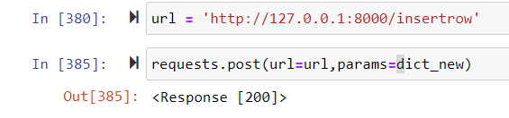

# PROJECT API: 
# Sentiment Analysis for Disney Reviews

***
APIs allows apps to send information between each other and they are used by developers who use APIs to enhance their products by accessing another company’s data or code, thereby providing additional features.

## Table of Contents
1. [Objectives](#1.-Objectives-↑)
2. [Methodology](#2.-Methodology-↑)
    2.1. [Dataset _Disney reviews_](#21-dataset-disney-reviews-↑)
    2.2. [Sentiment Analysis](#22-sentiment-analysis-↑)
    2.3. [SQL](#23-sql-↑)
    2.4. [API](#24-flask-api-↑)
3. [Functionality](#3-functionality-↑)
4. [Conclusion](#4-conclusion-↑)
    4.1. [Sentiment Analysis Conclusions](#41-sentiment-analysis-conclusions-↑)

## 1. Objectives [&uarr;](#table-of-contents)

* Serves information to clients (in response to their GET requests).

* Receives data from your clients (via their POST requests) and saves it to your own database.

## 2. Methodology [&uarr;](#table-of-contents)
As a work methodology, the database is collected to analyze the sentiment of each review and value it.

Once the valuation has been developed, the original database is complemented with these new values obtained, creating a new database and then transferring it to SQL. From here, the API that will be created will take the data to answer the user's requests.
User requests will be made through the API endpoints to return certain kind of messages (**GET**) or to add information through a **POST** of a row for the dataset in SQL

#### 2.1 Dataset _Disney reviews_ [&uarr;](#table-of-contents)
As a first step, it was selected from the Kaggle platform, a database that contains reviews from various countries around the world about the three Disneyland amusement parks.
These data was collected from 2010 to 2019.

.
.

#### 2.2. Sentiment Analysis [&uarr;](#table-of-contents)
Next, the data set obtained was cleaned of missing values and then analyzed under a lexicon and rule-based sentiment analysis tool that is specifically attuned to sentiments expressed in social media.
With this,determining whether a piece of writing is positive, negative or neutral. 

.
.

#### 2.3. SQL [&uarr;](#table-of-contents)
With the final dataset I created a database in SQL.
All the data sent and requested by the user will be used from here through the API, using JupyterNotebook.
Now the database to be used for the sentiment analysis will be taken from this SQL database.
.

#### 2.4. Flask API [&uarr;](#table-of-contents)
In order to make HTTP calls to the server for getting the data stored in the Disney database, we use the Flask framework in Jupyter. The API will be define by some endpoints I generate to make the API usefull for the user.
.

## 3. Functionality [&uarr;](#table-of-contents)

In order to apply what was learn in class, I create some endpoints usefull for any potential user.
Seven of those endpoints are for the user to get information and one more to post a row in the database: 
.

| Endpoint     | Description      | Link example     |
| ------------- | ------------- | -------- |
| 1          | get everything         | http://127.0.0.1:8000/sql  |
| 2           | get everything just for countries         | http://127.0.0.1:8000/Australia  |
| 3          | get the Compound for each branch          |http://127.0.0.1:8000/sa/Disneyland_HongKong  |
| 4           | get average compound from a branch in some year         | http://127.0.0.1:8000/avg/Disneyland_HongKong/2011  |
| 5          | get the total quantity of reviews for countries          | http://127.0.0.1:8000/countries/  |
| 6           | get get the total quantity of reviews for countries in a given branch         | http://127.0.0.1:8000/countries/Disneyland_HongKong  |
| 7           | get the average of positives for each branch         | http://127.0.0.1:8000/positives  |
| 8           | post Reviewer_Location, Review_Text, Branch and Year         | http://127.0.0.1:8000/insertrow  |
.

In order to do the POST of a single row, there is a dictionary created in jupyter where the post request takes you to the endpoint and here a new dictionary is inserted through the function to the database.

.
.

## 4. Conclusion [&uarr;](#table-of-contents)
Through the use of an application programming interface, I have been able to build a communication channel from a user to my database and deliver processed information and also take in information from the user to add into my database.
.

#### 4.1 Sentiment Analysis Conclusions [&uarr;](#table-of-contents)
In adition to the conclusion of the main task, here are some conclusions frome the sentiment analysis:
.

 .
 .
 .
 In the figure above, we can see the evolution of the compound for each Disney branch.
 The lowest compound belongs to Disney Paris more negatives reviews or less positives reviews in comparison with the other two branches.
 The California Disney has a slight downward trend, raising this scores the last two years.
.
.

Next, we can see the sentiment scores for each reviewers countries. 
The graph shows reviewers from India gave the best ratings
.

.
For the chart below, we can observe Disneyland Paris has the lowest rating because it has less positives reviews and more negatives reviews.

.
.

In general, the compound is high because the neutral reviews is high for almost every case:

